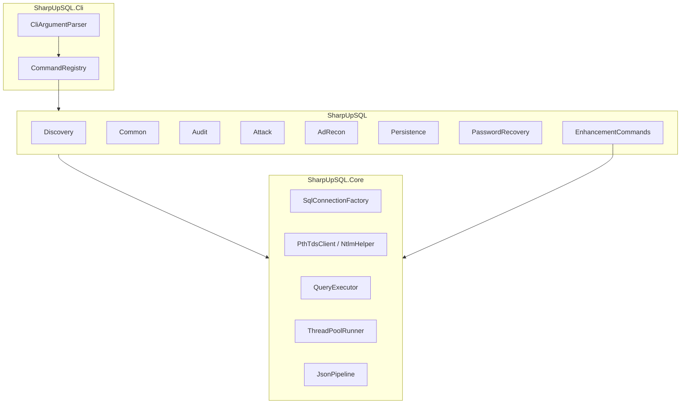

# SharpUpSQL：PowerUpSQL C# 移植与升级计划

本文档为 SharpUpSQL 的**长期维护路线图**，记录从 [PowerUpSQL](https://github.com/NetSPI/PowerUpSQL) 移植到 C#/.NET Framework 4.8 的原始目标、架构决策、分阶段路线，以及后续版本升级时的范围边界。实施状态以 [FUNCTION_PARITY.md](FUNCTION_PARITY.md) 为准。

| 文档 | 用途 |
|------|------|
| [PORTING_PLAN.md](PORTING_PLAN.md)（本文） | 移植目标、架构、阶段路线、升级边界 |
| [FUNCTION_PARITY.md](FUNCTION_PARITY.md) | 108 函数 × 实现/测试状态矩阵 |
| [COMMAND_REFERENCE.md](COMMAND_REFERENCE.md) | 用户向命令对照表 |

---

## 项目现状（截至 Phase 7）

- **源项目**：[NetSPI/PowerUpSQL](https://github.com/NetSPI/PowerUpSQL) v1.105.0，PowerShell 模块，无 SMO/SQLPS 依赖。
- **目标平台**：**.NET Framework 4.8 / 仅 Windows**，使用 `System.Data.SqlClient`。
- **CLI 注册**：**104 / 108** 个 PowerUpSQL 导出命令已实现；4 个 `Get-SQLFuzz*` 尚未暴露（fuzz 逻辑部分用于 audit）。
- **最小增强（Phase 6）**：8 项已全部实现（PtH、链式 Link、RPC、JSON 管道等）。
- **测试**：`tests\Run-Regression.ps1`（可 `-SkipLab`）；完整 lab 见 [lab/README.md](../lab/README.md)。

### 阶段完成状态

| 阶段 | 内容 | 状态 |
|------|------|------|
| Phase 0 | SQL Server lab + `FUNCTION_PARITY.md` 矩阵 | ✅ 完成 |
| Phase 1 | Core 连接层 + 6 Discovery + ConnectionTest | ✅ 完成 |
| Phase 2 | 35 Common 枚举 + LinkCrawl/DumpInfo | ✅ 完成 |
| Phase 3 | 16 Audit + `Invoke-SQLEscalatePriv` | ✅ 完成 |
| Phase 4 | OS 命令 5 通道 + Service Impersonation + DLL 辅助 | ✅ 完成 |
| Phase 5 | AD Recon 14 + Persistence 3 + Password Recovery 4 | ✅ 完成 |
| Phase 6 | 表 B 最小增强（PtH、Chain、RPC、JSON 等） | ✅ 完成 |
| Phase 7 | 全量回归 + README/命令对照文档 | ✅ 完成 |

---

## 一、PowerUpSQL 完整功能清单（移植范围）

以下按 [`PowerUpSQL.psd1`](https://raw.githubusercontent.com/NetSPI/PowerUpSQL/master/PowerUpSQL.psd1) 分组。C# 侧保持同名命令（大小写不敏感，参考 [mlcsec/SharpSQL](https://github.com/mlcsec/SharpSQL) 惯例）。模块 manifest 共导出 **108 个函数**（含 `Get-Domain*`、`Create-SQLFile*` 等辅助项；核心 SQL 命令约 97 个）。

| 类别 | 函数数 | 函数列表 |
|------|--------|----------|
| **Discovery** | 6 | `Get-SQLInstanceFile`, `Get-SQLInstanceLocal`, `Get-SQLInstanceDomain`, `Get-SQLInstanceScanUDP`, `Get-SQLInstanceScanUDPThreaded`, `Get-SQLInstanceBroadcast` |
| **Core** | 5 | `Get-SQLConnectionTest`, `Get-SQLConnectionTestThreaded`, `Get-SQLQuery`, `Get-SQLQueryThreaded`, `Invoke-SQLOSCmd` |
| **Common / 枚举** | 35 | `Get-SQLAgentJob`, `Get-SQLAuditDatabaseSpec`, `Get-SQLAuditServerSpec`, `Get-SQLColumn`, `Get-SQLColumnSampleData`, `Get-SQLColumnSampleDataThreaded`, `Get-SQLDatabase`, `Get-SQLDatabaseThreaded`, `Get-SQLDatabasePriv`, `Get-SQLDatabaseRole`, `Get-SQLDatabaseRoleMember`, `Get-SQLDatabaseSchema`, `Get-SQLDatabaseUser`, `Get-SQLServerConfiguration`, `Get-SQLServerCredential`, `Get-SQLServerInfo`, `Get-SQLServerInfoThreaded`, `Get-SQLServerLink`, `Get-SQLServerLinkCrawl`, `Get-SQLServerLinkData`, `Get-SQLServerLinkQuery`, `Get-SQLServerLogin`, `Get-SQLServerLoginDefaultPw`, `Get-SQLServerPolicy`, `Get-SQLServerPriv`, `Get-SQLServerRole`, `Get-SQLServerRoleMember`, `Get-SQLServiceAccount`, `Get-SQLServiceLocal`, `Get-SQLSession`, `Get-SQLStoredProcedure`, `Get-SQLStoredProcedureCLR`, `Get-SQLStoredProcedureSQLi`, `Get-SQLStoredProcedureAutoExec`, `Get-SQLStoredProcedureXp`, `Get-SQLSysadminCheck`, `Get-SQLTable`, `Get-SQLTableTemp`, `Get-SQLTriggerDdl`, `Get-SQLTriggerDml`, `Get-SQLView`, `Get-SQLLocalAdminCheck`, `Get-SQLOleDbProvder` |
| **Fuzz** | 4 | `Get-SQLFuzzDatabaseName`, `Get-SQLFuzzDomainAccount`, `Get-SQLFuzzObjectName`, `Get-SQLFuzzServerLogin` |
| **AD Recon** | 14 | `Get-SQLDomainObject`, `Get-SQLDomainComputer`, `Get-SQLDomainUser`, `Get-SQLDomainSubnet`, `Get-SQLDomainSite`, `Get-SQLDomainGroup`, `Get-SQLDomainOu`, `Get-SQLDomainAccountPolicy`, `Get-SQLDomainTrust`, `Get-SQLDomainPasswordsLAPS`, `Get-SQLDomainController`, `Get-SQLDomainExploitableSystem`, `Get-SQLDomainGroupMember` |
| **AD Helpers** | 2 | `Get-DomainObject`, `Get-DomainSpn` |
| **Audit** | 16 | `Invoke-SQLAudit` + 15 个子审计：`PrivCreateProcedure`, `PrivDbChaining`, `PrivImpersonateLogin`, `PrivServerLink`, `PrivTrustworthy`, `PrivXpDirtree`, `PrivXpFileexit`, `RoleDbDdlAdmin`, `RoleDbOwner`, `SampleDataByColumn`, `WeakLoginPw`, `SQLiSpExecuteAs`, `SQLiSpSigned`, `DefaultLoginPw`, `PrivAutoExecSp` |
| **Attack / 提权** | 11 | `Invoke-SQLDumpInfo`, `Invoke-SQLEscalatePriv`, `Invoke-SQLImpersonateService`, `Invoke-SQLImpersonateServiceCmd`, `Invoke-SQLOSCmdCLR`, `Invoke-SQLOSCmdCOle`, `Invoke-SQLOSCmdPython`, `Invoke-SQLOSCmdR`, `Invoke-SQLOSCmdAgentJob`（`Invoke-SQLOSCmd` 已在 Core） |
| **Password Recovery** | 4 | `Get-SQLRecoverPwAutoLogon`, `Get-SQLServerPasswordHash`, `Invoke-SQLUncPathInjection`, `Invoke-TokenManipulation` |
| **Persistence** | 3 | `Get-SQLPersistRegRun`, `Get-SQLPersistRegDebugger`, `Get-SQLPersistTriggerDDL` |
| **Helper / 文件** | 3 | `Create-SQLFileXpDll`, `Create-SQLFileCLRDll`, `Get-SQLAssemblyFile` |

**移植验收标准**：每个函数在具备相应权限的 SQL Server 实验环境中，行为与 PowerUpSQL 一致（参数、输出字段、`-Exploit` 提权路径、多线程 `-Threads`、管道式批量输入）。

**刻意不纳入「功能缺失」的范围**（PowerUpSQL 官方 Roadmap 未实现）：数据渗出模块（`Get-SQLExfil*` 系列）、`Get-SQLInstanceScanTCP`/`Get-SQLInstanceAzure*`、Roadmap 中未合并的审计项——这些属于源项目未完成项，不在「功能一个都不能少」范围内。

**待办（后续迭代）**：4 个 `Get-SQLFuzz*` 命令 CLI 暴露；lab 全量 golden snapshot PASS 标记（见 [FUNCTION_PARITY.md](FUNCTION_PARITY.md)）。

---

## 二、同类项目调研与功能对比表

调研对象：[SQLRecon](https://github.com/skahwah/SQLRecon)、[SharpSQL](https://github.com/mlcsec/SharpSQL)、[MAT](https://github.com/SySS-Research/MAT)、[SharpSQLPwn](https://github.com/lefayjey/SharpSQLPwn)、[MSSqlPwner](https://github.com/ScorpionesLabs/MSSqlPwner)、[mssql-spider](https://github.com/dadevel/mssql-spider)、[DAFT](https://github.com/NetSPI/DAFT)。

### 表 A：PowerUpSQL 已有、多数 C# 项目缺失的能力（移植时必须保留）

| 能力 | PowerUpSQL | SQLRecon | SharpSQL | MAT | 说明 |
|------|:----------:|:--------:|:--------:|:---:|------|
| 14 项专项审计 + `Invoke-SQLAudit` 聚合 | ✅ | 部分 | ❌ | 部分 | SharpUpSQL 核心差异化 |
| `Invoke-SQLEscalatePriv` 自动提权编排 | ✅ | ❌ | ❌ | 部分 | 需完整复刻提权决策树 |
| AD LDAP 侦察 14 函数（经 OPENQUERY/ADSI） | ✅ | 有限 | ❌ | ❌ | 含 LAPS、委派用户等过滤 |
| `Invoke-SQLImpersonateService( Cmd )` | ✅ | ❌ | ❌ | ❌ | 服务账户 impersonation |
| 持久化（RegRun/Debugger/DDL Trigger） | ✅ | ❌ | ❌ | ❌ | |
| `Invoke-SQLUncPathInjection` 全自动域内喷洒 | ✅ | 单点 Smb | Get-Hash | relay | |
| `Invoke-SQLDumpInfo` CSV/XML 全量资产导出 | ✅ | 分散模块 | ❌ | ❌ | |
| Fuzz 四函数 | ✅ | ❌ | ❌ | ❌ | |
| 列采样 + Luhn 信用卡校验 | ✅ | Search | ❌ | ❌ | |
| 多线程批量（ConnectionTest/Query/Info 等） | ✅ | 多主机 | ❌ | ❌ | |

### 表 B：最小增强（Phase 6，已实现）

| # | 功能 | 来源项目 | 优先级 | SharpUpSQL 实现 |
|---|------|----------|--------|-----------------|
| 1 | NTLM Pass-the-Hash 认证 | SQLRecon v4.0 `Pth` | P0 | `-Hash` + `PthTdsClient` |
| 2 | Linked Server 链式执行（A→B→C） | SQLRecon `/chain`、MAT | P0 | `Invoke-SQLLinkedChainQuery` |
| 3 | Enable/Disable RPC + RPC OUT | SQLRecon、MAT | P0 | `Invoke-SQLEnableRpc` / `Invoke-SQLDisableRpc` |
| 4 | JSON 管道输入/输出 | mssql-spider | P1 | `--stdin json` / `--format json` |
| 5 | 自定义 TCP 端口 | SQLRecon `/port` | P1 | `-Port` |
| 6 | 连接字符串高级选项 | PowerUpSQL Roadmap | P1 | `-Encrypt`, `-ForceNamedPipe`, `-PacketSize` |
| 7 | Debug/Verbose SQL 预览 | SQLRecon `/debug` | P2 | `-Debug` |
| 8 | 多主机逗号分隔批量 | SQLRecon `/h:SQL01,SQL02` | P2 | `-Instance h1,h2[,port]` |

### 表 C：优秀项目有、但明确不做的功能（供后续大版本参考）

| 功能 | 来源 | 不纳入原因 |
|------|------|------------|
| SCCM/ECM 攻击模块 | SQLRecon | 范围过大，非 MSSQL 核心 |
| Azure / EntraID 认证 | SQLRecon、SharpSQLPwn | 最小增强；PowerUpSQL 本身无 Azure |
| 攻击链自动发现 + Interactive REPL | MSSqlPwner | 复杂度高，属自动化 spider 层 |
| 凭据喷洒 + BloodHound SPN 发现 | mssql-spider | 需外部工具链集成 |
| Kerberos PtT/PtK/Overpass | mssql-spider | 超出 PowerUpSQL 能力边界 |
| 配置文件连接字符串扫描 | SqlServerSecurityAudit | 防御向 AppSec，非 PowerUpSQL 范畴 |
| SQL Injection 攻击 | NetSPI SQL Wiki | PowerUpSQL 官方声明不支持 |

---

## 三、架构



**当前项目结构**

```text
SharpUpSQL/
├── SharpUpSQL.sln
├── build.ps1
├── src/
│   ├── SharpUpSQL.Core/     # 连接、认证、TDS/PtH、线程、JSON I/O
│   ├── SharpUpSQL/          # 命令实现（按 PowerUpSQL 分类）
│   └── SharpUpSQL.Cli/      # CLI 入口与 CommandRegistry
├── tests/
│   ├── SharpUpSQL.Tests/
│   ├── run-unit-tests.ps1
│   ├── Run-Regression.ps1
│   └── Run-LabRegression.ps1
├── lab/                     # SQL Server lab 脚本与 golden snapshots
└── docs/
    ├── PORTING_PLAN.md      # 本文
    ├── FUNCTION_PARITY.md
    └── COMMAND_REFERENCE.md
```

**技术选型**

- **.NET Framework 4.8**，`System.Data.SqlClient`（与 PowerUpSQL 一致）。
- **构建**：`build.ps1` 调用 `csc` 直接编译，无 NuGet 依赖。
- **PtH**：`PthTdsClient` + `NtlmHelper`，raw TDS/NTLM（`-Hash`）。
- **Linked Chain**：`LinkedChainQueryBuilder`，支持 `EXEC ... AT [link]` 嵌套。
- **UNC/Hash 捕获**：与 Responder/Inveigh 兼容的 `xp_dirtree`/`xp_fileexist` 参数化。
- **CLR 执行**：`ClrDllGenerator` 动态编译模板。
- **输出**：默认人类可读；`--format json` 启用管道模式。

---

## 四、分阶段实施路线（历史记录）

各阶段已完成；新功能或 PowerUpSQL 版本升级时，按相同阶段扩展并更新 [FUNCTION_PARITY.md](FUNCTION_PARITY.md)。

### Phase 0：基线与实验环境
- 搭建 2–3 台 SQL Server lab（本地实例、Link Server、低权+Impersonate 场景）。
- 建立 `FUNCTION_PARITY.md`：108 函数 × 测试状态矩阵。
- 从 PowerUpSQL 导出典型命令输出作为 golden snapshot。

### Phase 1：Core + Discovery（11 函数）
- 连接工厂：WinToken、SQL Auth、连接测试、Query 执行、线程池。
- 6 个 Discovery 函数 + `Get-SQLConnectionTest( Threaded )`。
- **验收**：`Get-SQLInstanceDomain | Get-SQLServerInfo` 与 PowerUpSQL 输出字段一致。

### Phase 2：Common 枚举（35 函数）
- 数据库/表/列/权限/Link/Agent/CLR 等只读枚举。
- `Get-SQLServerLinkCrawl/Data/Query` 与多线程变体。
- **验收**：`Invoke-SQLDumpInfo` 可生成等价 CSV/XML。

### Phase 3：Audit + Escalation（17 函数）
- 15 个子审计 + `Invoke-SQLAudit` + `Invoke-SQLEscalatePriv`。
- 每个审计的 `-Exploit` 路径单独测试。
- **验收**：lab 中至少 3 种提权路径（Impersonate、DbOwner、WeakPw）自动化成功。

### Phase 4：Attack + OS 命令执行（10 函数）
- xp_cmdshell、CLR、OLE、R/Python AgentJob、Service Impersonation。
- `Create-SQLFileXpDll/CLRDll`、`Get-SQLAssemblyFile`。
- **验收**：五种 OS 命令通道在 sysadmin 下均可执行。

### Phase 5：AD Recon + Persistence + Password Recovery（21 函数）
- LDAP via OPENQUERY/OPENROWSET 14 函数。
- 持久化 3 函数、哈希/UNC/AutoLogon/TokenManipulation。
- **验收**：sysadmin 下可拉取 Domain Users；UNC 可触发 NTLM。

### Phase 6：最小增强（表 B，P0–P2）
- P0：PtH、Linked Chain、RPC Enable/Disable。
- P1：JSON 管道、自定义端口、连接字符串高级选项。
- P2：Debug 模式、多主机 CLI 语法糖。

### Phase 7：全量回归与文档
- 104/108 PowerUpSQL 命令 + 8 增强项注册完成。
- README、COMMAND_REFERENCE、FUNCTION_PARITY、lab 文档齐备。

---

## 五、风险与对策

| 风险 | 对策 |
|------|------|
| PowerUpSQL.psm1 单文件 1 万+ 行，逻辑分散 | 按函数拆 C# 类，每函数对照 wiki + 源码片段 |
| ADSI/LDAP 多值属性限制 | 与 PowerUpSQL 一致：文档注明 limitation，不强行突破 |
| PtH raw TDS 实现复杂 | 参考 SQLRecon v4.0；`PthTdsClient` 集成测试 |
| 无 lab 无法验证 Exploit | `Run-Regression.ps1 -SkipLab` 跑单元测试；lab 可选 |
| `Invoke-TokenManipulation` 依赖 Win32 API | `TokenManipulationHelper` P/Invoke |
| PowerUpSQL 上游版本升级 | 对比新 `PowerUpSQL.psd1` → 更新 FUNCTION_PARITY 行 → 按 Phase 增量实现 |

---

## 六、版本升级工作流

当 PowerUpSQL 发布新版本或需要扩展 SharpUpSQL 时：

1. **对比 manifest**：拉取新版 `PowerUpSQL.psd1` 的 `FunctionsToExport`，与 [FUNCTION_PARITY.md](FUNCTION_PARITY.md) 逐行 diff。
2. **更新矩阵**：新增函数加行；行为变更更新 Notes；C#/Unit/Lab/Snapshot 列重置为进行中。
3. **按 Phase 归类**：Discovery → Common → Audit → Attack → AD → 增强，避免跨模块大范围改动。
4. **Lab 验证**：更新 `lab/snapshots/` golden 输出；`Run-LabRegression.ps1 -CompareSnapshots`。
5. **文档同步**：更新 [COMMAND_REFERENCE.md](COMMAND_REFERENCE.md)、README Features 计数、本文「项目现状」与阶段表。
6. **回归门禁**：`tests\Run-Regression.ps1` 全绿后再发版。

---

## 七、CLI 形态（兼容 PowerUpSQL 习惯）

```text
SharpUpSQL.exe Get-SQLInstanceDomain
SharpUpSQL.exe Invoke-SQLAudit -Instance "SQL01\INST" -Verbose
SharpUpSQL.exe Get-SQLInstanceDomain | SharpUpSQL.exe Invoke-SQLAudit --stdin json
SharpUpSQL.exe Get-SQLServerInfo -Instance localhost,1433 -Username sa -Hash <ntlm> -Domain CORP -Verbose
```

---

_Last maintained: Phase 7 complete. Source plan archived from project bootstrap; sync with FUNCTION_PARITY.md on each release._
